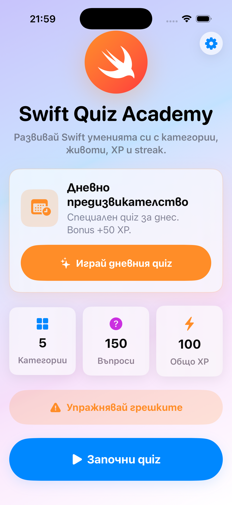
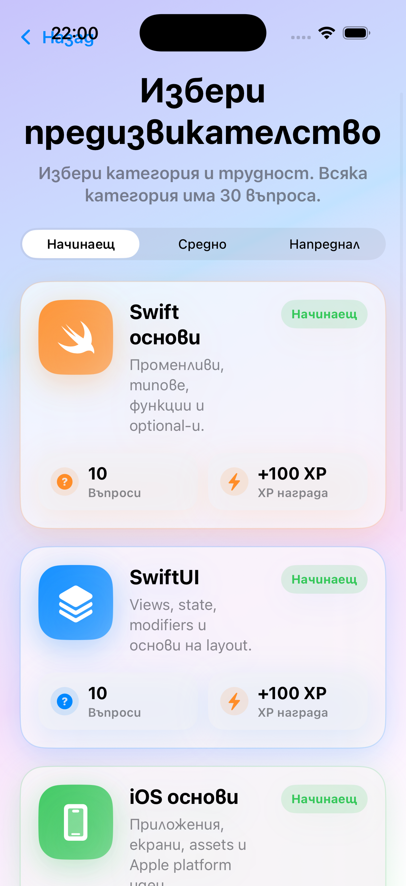
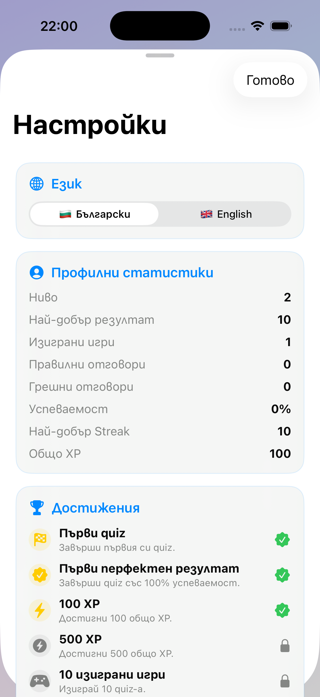
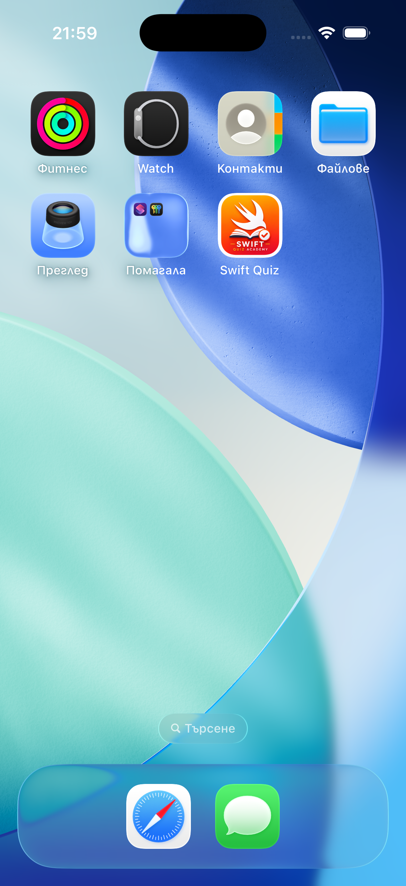

# Swift Quiz Academy


Swift Quiz Academy is a modern SwiftUI learning app for practicing Swift, SwiftUI, iOS concepts, logic, and AI fundamentals through interactive quizzes, XP progression, achievements, and daily learning habits.

---

## Table of Contents

- [Screenshots](#screenshots)
- [Features](#features)
- [Version 1.4.1 Highlights](#version-141-highlights)
- [Version 1.4 Highlights](#version-14-highlights)
- [Version 1.3.1 Highlights](#version-131-highlights)
- [Version 1.3 Highlights](#version-13-highlights)
- [Version 1.2 Highlights](#version-12-highlights)
- [Requirements](#requirements)
- [Getting Started](#getting-started)
- [Architecture](#architecture)
- [Project Structure](#project-structure)
- [Tests](#tests)
- [Roadmap](#roadmap)
- [Contributing](#contributing)

---

## Screenshots

<p align="center">
  
  
  
  
</p>

---

## Features

- Interactive quiz categories for Swift, SwiftUI, iOS, Logic, and AI
- Expanded categories for Git & GitHub, Architecture & MVVM, and Xcode & Debugging
- Local JSON question database for easier content expansion
- Learning Library for browsing and studying questions outside quiz mode
- Live search across question and explanation text in Bulgarian and English
- Library filters for category, difficulty, and favorite questions
- Favorite questions stored locally by stable question ID
- Beginner, Intermediate, and Advanced difficulty levels
- XP system with animated level progress
- 10-level progression system with Swift-themed titles
- Daily Reward system: +25 XP once per day
- 7-day login streak bonus: +100 XP
- Daily Challenge mode with bonus XP
- Achievement system with automatic unlocks
- Practice Mistakes mode for reviewing missed questions
- Answer review screen after quizzes
- Statistics tracking for XP, games played, answers, accuracy, streaks, and high score
- Category mastery statistics with completed questions and mastery percentage
- Library statistics for favorite questions and searches performed
- Bulgarian and English localization
- Light, Dark, and System theme support
- UserDefaults persistence for progress, language, theme, streaks, rewards, mistakes, and achievements
- Modern SwiftUI interface with animated cards, reward popup, progress bar, and confetti feedback

---

## Version 1.4.1 Highlights

- Fixed celebration/confetti cleanup so no leftover particles remain on the Home screen.
- Improved Reduce Motion support by disabling decorative animations while keeping app flows functional.
- Improved Dynamic Type resilience across Home, Library, Quiz, Result, and shared profile/stat rows.
- Updated Daily Challenge to reuse the JSON-backed question database instead of hardcoded challenge questions.
- Added UI smoke tests for launch, quiz start, quiz completion, Settings, and Library flows.
- Improved GitHub Actions by selecting an available iOS Simulator dynamically instead of relying on a hardcoded device name.

---

## Version 1.4 Highlights

- Added a new Library destination alongside Home and Settings.
- Added a Question Library powered by the existing local JSON database.
- Added total question count and per-category counts.
- Added live search across question and explanation text in Bulgarian and English.
- Added category and difficulty filters that work together.
- Added favorite questions stored locally with stable `question.id` values.
- Added a Favorite Questions mode and friendly empty states.
- Added question detail study pages with answers, correct answer, explanation, category, and difficulty.
- Added Library statistics for total favorites and searches performed.
- Added tests for favorites persistence, search, filters, and empty states.

---

## Version 1.3.1 Highlights

- Fixed Perfect Score and Perfect Quiz Master achievement logic for 21-question quizzes.
- Perfect achievements now unlock only when the quiz result is exactly 100%.
- Added standalone JSON validation tooling for local development and CI.
- Improved GitHub Actions to validate JSON, build the app, and run unit tests.
- Added focused tests for perfect achievement edge cases and question database validation failures.

Run JSON validation locally:

```bash
node Scripts/validate_questions.js
```

---

## Version 1.3 Highlights

- Expanded the local JSON question database to 504 questions.
- Added 8 production learning categories:
  - Swift Basics
  - SwiftUI
  - iOS Development
  - Programming Logic
  - AI for Developers
  - Git & GitHub
  - Architecture & MVVM
  - Xcode & Debugging
- Each category now includes 21 Beginner, 21 Intermediate, and 21 Advanced questions.
- Added practical scenario-based questions for Swift, SwiftUI, debugging, architecture, Git workflows, and AI-assisted development.
- Added strict automated validation for duplicate IDs, answer count, correct answers, category IDs, difficulty values, and explanations.
- Added category mastery tracking for total questions, completed questions, and mastery percentage.

---

## Version 1.2 Highlights

- Moved the main quiz question database from hardcoded Swift arrays into local JSON files.
- Added JSON files for local learning categories.
- Added `QuestionLoader` for safe Bundle loading, decoding, validation, and grouping by category/difficulty.
- Kept Bulgarian and English question text, answer choices, correct answers, and explanations in data files.
- Made content expansion safer: adding questions no longer requires editing large Swift arrays.
- Added safe empty state behavior if local question data fails to load.
- Added unit tests for JSON loading, decoding, grouping, and difficulty filtering.
- Added Version 1.2 hardening for App Store readiness: privacy manifest, iOS 17.0 deployment target, version consistency, safer JSON diagnostics, stable mistake identifiers, persistence schema version, and basic accessibility safeguards.

---

## Version 1.1 Highlights

- Added Daily Rewards with once-per-day claiming
- Added login streak and best login streak tracking
- Added 7-day reward bonus
- Improved Home XP progress bar
- Added global Dark Mode preference
- Added new achievements:
  - 7 Day Streak
  - 500 XP
  - 1000 XP
  - 10 Quizzes Played
  - 50 Correct Answers
  - Perfect Quiz Master
- Added reward claim animation and achievement confetti
- Added focused unit tests for rewards, theme persistence, level progression, localization, and achievements

---

## Requirements

- macOS with Xcode installed
- Xcode 16 or newer recommended
- iOS 17.0 or newer
- iOS Simulator or iOS device
- Swift 6 compatible toolchain

---

## Getting Started

1. Clone the repository:

```bash
git clone https://github.com/BobbyUzunov/swift-quiz-academy.git
```

2. Open the project in Xcode:

```bash
open "Swift Quiz Academy.xcodeproj"
```

3. Select the `Swift Quiz Academy` scheme.

4. Build and run on an iOS Simulator.

---

## Architecture

The app follows an MVVM structure with small supporting models and persistence helpers.

```text
Swift Quiz Academy/
├── Models/
├── ViewModels/
├── Views/
└── Assets.xcassets/
```

Key pieces:

- `QuizViewModel` manages quiz state, XP, levels, rewards, achievements, statistics, and navigation.
- `QuizProgressStore` centralizes UserDefaults persistence.
- `QuestionLoader` loads and validates the local JSON question database.
- `DailyRewardManager` handles daily reward and login streak calculations.
- `AppTheme` manages Light, Dark, and System theme selection.

Privacy and persistence:

- The app does not collect personal data, track users, or share data with third parties.
- Progress is stored locally on device with UserDefaults.
- `PrivacyInfo.xcprivacy` declares UserDefaults access through Apple's required-reason API privacy manifest.

---

## Project Structure

```text
Swift Quiz Academy/
├── Models/
│   ├── Achievement.swift
│   ├── AppLanguage.swift
│   ├── AppTheme.swift
│   ├── DailyReward.swift
│   ├── Difficulty.swift
│   ├── QuizCategory.swift
│   └── QuizQuestion.swift
├── QuestionData/
│   ├── ai_for_developers.json
│   ├── architecture_mvvm.json
│   ├── git_github.json
│   ├── ios_development.json
│   ├── programming_logic.json
│   ├── swift_basics.json
│   ├── swiftui.json
│   └── xcode_debugging.json
├── PrivacyInfo.xcprivacy
├── Services/
│   └── QuestionLoader.swift
├── ViewModels/
│   ├── QuizProgressStore.swift
│   └── QuizViewModel.swift
├── Views/
│   ├── HomeView.swift
│   ├── QuizView.swift
│   ├── SettingsView.swift
│   └── CelebrationViews.swift
├── Assets.xcassets/
└── Swift_Quiz_AcademyApp.swift
```

---

## Tech Stack

- Swift
- SwiftUI
- Observation
- MVVM
- UserDefaults
- Swift Testing
- Xcode

---

## Tests

The project includes unit tests for:

- Quiz answer flow
- XP and level progression
- Daily Challenge reward behavior
- Daily Reward claiming and 7-day bonus
- Theme preference persistence
- Achievement unlocking
- Progress reset and reload
- Persistence schema initialization
- Practice Mistakes migration from legacy text identifiers to stable question IDs
- Bulgarian question localization
- Local JSON loading, decoding, grouping, and difficulty filtering
- Strict question database validation
- Category mastery tracking

Latest local verification:

```text
xcodebuild test   - passed
xcodebuild build  - passed
```

Run the app build locally:

```bash
DEVELOPER_DIR=/Applications/Xcode.app/Contents/Developer \
xcodebuild build \
  -project "Swift Quiz Academy.xcodeproj" \
  -scheme "Swift Quiz Academy" \
  -destination "generic/platform=iOS" \
  CODE_SIGNING_ALLOWED=NO
```

---

## Roadmap

### Version 1.3

- Cloud synchronization
- User profiles
- Online leaderboards
- More quiz categories
- Expanded JSON question database

### Version 2.0

- Multiplayer challenges
- Community features
- Advanced learning paths
- App Store polish

---

## Contributing

Contributions, ideas, and improvements are welcome. Please see [CONTRIBUTING.md](CONTRIBUTING.md) for setup, branch, and pull request guidelines.

---

## License

This project is available under the [MIT License](LICENSE).

---

## Author

Boncho Uzunov

GitHub: https://github.com/BobbyUzunov

---

## Support

If you found this project useful, consider giving it a star.
